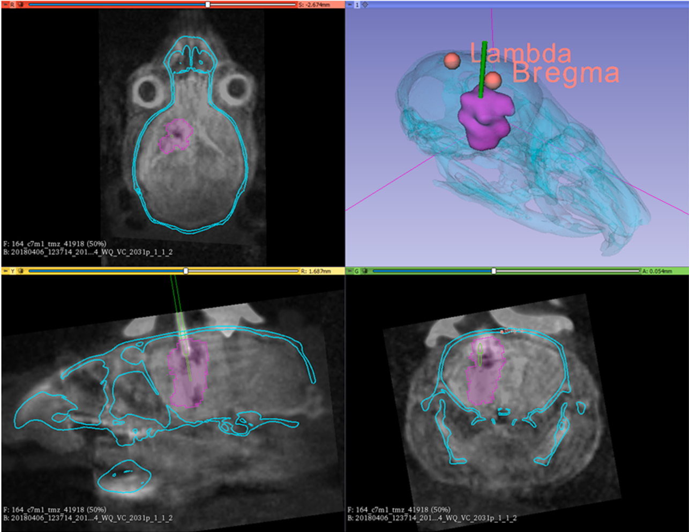

# Methods for intratumoral microdialysis probe targeting and validation in murine brain tumor models
This repository offers the template files for the tumor targeting and validation in mice.

## Overview
While precision stereotactic frames are used broadly in large animal models (e.g. porcine, non-human primate,...) for anatomical targeting, there are limited techniques for small animal models.

Facilitated with a [Kopf stereotaxic frame](http://kopfinstruments.com/product_category/small-animal-stereotaxic/) using bite pins and ear pins, repeatable surgeries can be performed.

This 3D Slicer medical record bundle ([mrb](https://www.slicer.org/wiki/Documentation/4.1/SlicerApplication/MainApplicationGUI#Medical_Reality_Bundle_.28.mrb.29_Note)) file encapsulates the following structures to assist with anatomical targeting in murine models:

 * Reference Skull
 * Control Mouse MRI
 * Control Mouse CT
 * Fixed Fiducials for Bregma and Lamda
 * Movable Fiducials for a Tumor Center

The MRB file is formulated for 3D Slicer v4.11.

## Link to Paper
The [original paper](https://www.sciencedirect.com/science/article/abs/pii/S0165027021002569) has the explicit directions.

## Abstract
*Background*: Microdialysis is a well validated sampling technique that can be used for pharmacokinetic studies of
oncological drugs targeting the central nervous system. This technique has also been applied to evaluate tumor
metabolism and identify pharmacodynamic biomarkers of drug activity. Despite the potential utility of micro­
dialysis for therapeutic discovery, variability in tumor size and location hamper routine use of microdialysis as a
preclinical tool. Quantitative validation of microdialysis membrane location relative to radiographically evident
tumor regions could facilitate rigorous preclinical studies. However, a widely accessible standardized workflow
for preclinical catheter placement and validation is needed.

*New method*: We provide methods for a workflow to yield tailored placement of microdialysis probes within a
murine intracranial tumor and illustrate in an IDH1-mutant patient-derived xenograft (PDX) model. This detailed
workflow uses a freely available on-line tool built within 3D-slicer freeware to target microdialysis probe
placement within the tumor core and validate probe placement fully within the tumor.
Results: We illustrate use of this workflow to validate microdialysis probe location relative to implanted IDH1-
mutant PDXs, using the microdialysis probes to quantify levels of extracellular onco-metabolite D-2
hydroxyglutarate.

*Comparison with existing methods*: Previous methods have used 3D slicer to reliably measure tumor volumes. Prior
microdialysis studies have targeted expected tumor locations without validation.
Conclusions: The new method offers a streamlined and freely available workflow in 3D slicer to optimize and
validate microdialysis probe placement within a murine brain tumor.

## Data Availability
For data associated with the paper, please defer to the corresponding author of the paper.